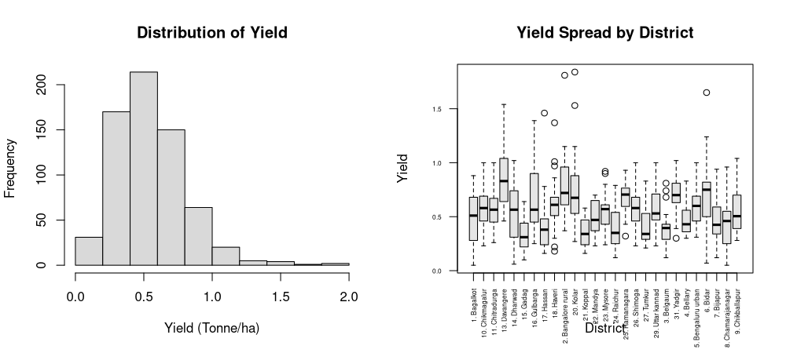
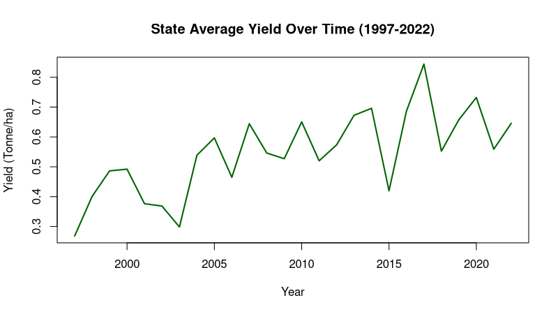
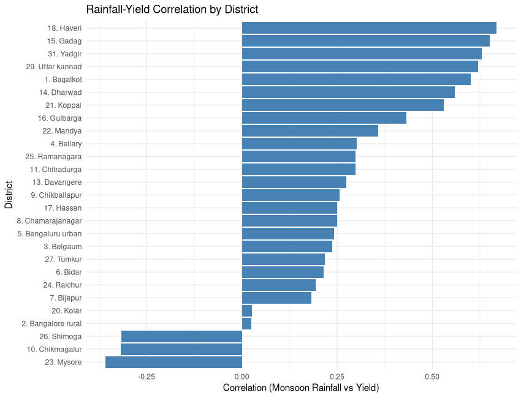
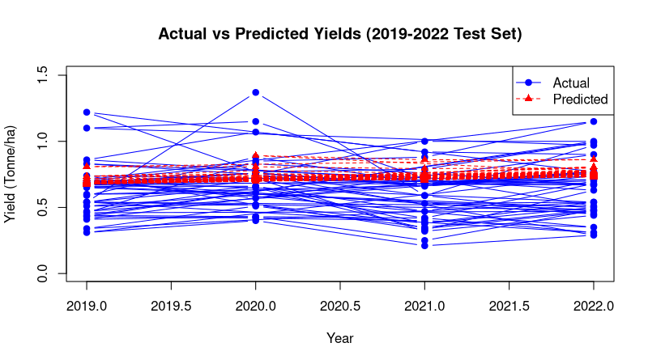
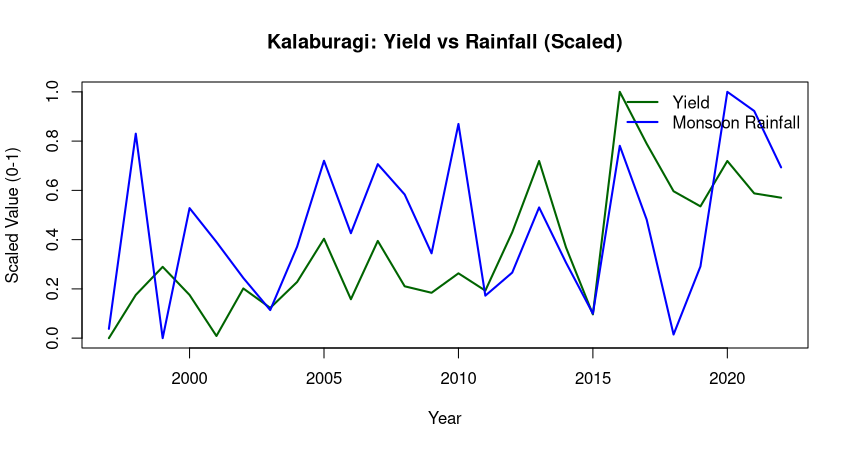

# Karnataka Pigeon Pea (Tur) Agroclimatology & Yield Analysis (1997–2022)

An end-to-end econometric and agricultural data pipeline in **R** examining the relationship between precipitation dynamics and Pigeon Pea (*Cajanus cajan*) productivity across Karnataka, India.

---

## 📌 Project Overview
Pigeon Pea (Tur) is Karnataka's premier rainfed pulse crop, concentrated in the semi-arid northern tracts. This project extracts district-level government crop statistics, dynamically fetches gridded monthly meteorological data via the **NASA POWER API**, and performs statistical modeling (OLS, Panel Fixed-Effects, Out-of-Sample Validation, and District Sensitivity).

---

## 🛠️ Tech Stack & Workflow
* **Web Scraping:** `rvest` (extracting and cleaning unstructured government HTML tables)
* **Meteorological Ingestion:** `nasapower` (dynamic centroid coordinate API queries)
* **Statistical Modeling:** Base R OLS (`lm`), Panel Data Regression (`plm`), ANOVA
* **Visualization:** Base R graphics, `ggplot2`

---

## 📊 Visualizations & Key Findings

### 1. Yield Distribution & District Disparities
Yield data is right-skewed, clustering between **0.4 and 0.6 Tonne/ha** with distinct high-yield outlier years across specific districts.



---

### 2. State-Wide Yield Trend
Long-term state productivity reflects steady growth driven by improved seed varieties and agronomic practices.



---

### 3. District-Level Rainfall Sensitivity
Kharif monsoon rainfall (June–September) correlation with yield varies widely across agro-ecological zones:



---

### 4. Out-of-Sample Model Validation (2019–2022)
* **Model RMSE:** `0.238` Tonne/ha
* **Naive Baseline RMSE:** `0.243` Tonne/ha

The marginal improvement over the naive baseline illustrates that total precipitation volume alone is insufficient for predicting pulse yield—distribution timing and non-weather variables play decisive roles.



---

### 5. Focus: Kalaburagi Pulse Bowl
A localized study of Kalaburagi highlights the high co-movement and annual volatility between Kharif monsoon totals and final harvest yield.



---

## 📂 Project Structure

```text
├── horizontal_crop_vertical_year_report(2).xls   # Raw input government table
├── main_analysis.R                                # Complete end-to-end R script
├── README.md                                     # Project report and documentation
├── plots/                                        # Exported figures displayed above
│   ├── 01_yield_distribution_and_box.png
│   ├── 02_state_yield_trend.png
│   ├── 03_model_diagnostics.png
│   ├── 04_district_correlation.png
│   ├── 05_actual_vs_predicted.png
│   └── 06_kalaburagi_dynamics.png
└── outputs/ (or CSVs generated in root)
    ├── kalaburagi_pigeon_pea_clean.csv
    ├── karnataka_tur.csv
    ├── kalaburagi_rain.csv
    ├── karnataka_district_coordinates.csv
    └── district_rainfall_sensitivity.csv
```

2. Open R / RStudio and execute `main_analysis.R`.